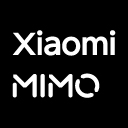

<div align="center">

[中文](README_CN.md) | **English**

# cc-code

**Terminal coding agent powered by open-source models — Rust-built, Claude Code compatible**

DeepSeek-V4-Pro + Mimo-2.5Pro + GLM-5.1 driven, zero migration from `.claude/` config, runs on RISC-V.

[](https://www.npmjs.com/package/@cc-claw/code)
[](https://github.com/cc-claws/cc-code/stargazers)
[](LICENSE)
[](https://www.cc-claw.com)
[](https://github.com/cc-claws/cc-code/commits/main)

<p align="center"><code>npm install -g @cc-claw/code</code></p>

### 🌐 Official Website: **[cc-claw.com](https://www.cc-claw.com)**

[Why cc-code](#why-cc-code) · [Core Capabilities](#core-capabilities) · [Install](#install) · [Nobody Coding](#how-we-built-cc-code-with-nobody-coding) · [Acknowledgments](#acknowledgments)

</div>

## ❤️Sponsor

> [Want to appear here?](mailto:wismyzhizi2018@gmail.com)

<details open>
<summary>Click to collapse</summary>

[](https://platform.moonshot.cn/console?aff=cc-code)

Kimi K2.6 is an open-source, native multimodal agentic model from Moonshot AI, built for long-horizon coding, coding-driven design, and swarm-based task orchestration. It handles complex end-to-end engineering work across front-end, DevOps, performance optimization, and full-stack workflows. [Register here](https://platform.moonshot.cn/console?aff=cc-code)

---

<table>
<tr>
<td width="180"><a href="https://platform.xiaomimimo.com?ref=JBEYTF"></a></td>
<td>Top-tier model MiMo V2.5 from Xiaomi. Register with invite code: both get ¥10 API credit + 10% off first order. Invite code: JBEYTF. <a href="https://platform.xiaomimimo.com?ref=JBEYTF">Register here</a> (auto-filled on registration · credit valid for 40 days)</td>
</tr>

<tr>
<td width="180"><a href="https://www.bigmodel.cn/glm-coding?ic=MR7BVITFAY"></a></td>
<td>GLM Coding Plan from Zhipu AI — top-tier coding model in China, compatible with 20+ mainstream tools, best value. <a href="https://www.bigmodel.cn/glm-coding?ic=MR7BVITFAY">Join now</a></td>
</tr>
</table>

</details>

---

## Why cc-code?

| Comparison | Other Terminal Agents | cc-code |
|------------|----------------------|------|
| Runtime | Node.js / Bun, easily eats 1GB RAM | Rust native, fast startup, ~50MB memory |
| Model Lock-in | Locked to one LLM | Switch freely: Anthropic, OpenAI-compatible, DeepSeek, GLM |
| Prompt Cache | Recompute every turn, wasting tokens | Frozen system prompt, 95-99% cache hit rate |
| Tool Loading | All tools stuffed into every request | Core tools resident, rest lazy-loaded via Tool Search |
| IDE Integration | Terminal only | ACP protocol, Zed and other IDEs connect directly |
| Claude Code Ecosystem | Incompatible | Use `.claude/` config, agents, skills, hooks, MCP directly |

---

## Core Capabilities

| Capability | Description |
|------------|-------------|
| **Rust Native** | Fast startup, low memory, zero runtime overhead |
| **Context Optimized** | System prompt frozen + dynamic content isolated, no token waste |
| **Multi-LLM Support** | Anthropic / OpenAI-compatible APIs, DeepSeek, GLM — switch freely |
| **Claude Code Compatible** | `.claude/` config, agents, skills, hooks, MCP, sub-agents all reusable |
| **Streaming Markdown** | Code blocks, tables, diffs rendered in real-time |
| **ACP Protocol** | Connect to Zed and other IDEs, or build your own "Cloud Code" platform |
| **Auto Compact** | Long sessions auto-compressed, stays fast and cheap |
| **Sub-Agent Concurrency** | Background sub-agents run in parallel with fork and background modes |
| **HITL Approval** | Sensitive operations auto-intercepted with auto-classifier and shared-mode |
| **Nobody Coding** | 99% of code produced by DeepSeek, Mimo, and GLM — humans decide what, AI figures out how |

---

## Install

Binaries available for macOS (x86_64 / Apple Silicon), Linux (x86_64 / aarch64 / riscv64), and Windows (x86_64).

### npm (Recommended)

```bash
npm install -g @cc-claw/code
```

### Upgrade

```bash
npm update -g @cc-claw/code
```

### macOS / Linux (Script)

```bash
curl -fsSL https://raw.githubusercontent.com/cc-claws/cc-code/main/scripts/install.sh | bash
```

### Windows (PowerShell)

```powershell
irm https://raw.githubusercontent.com/cc-claws/cc-code/main/scripts/install.ps1 | iex
```

---

## How We Built cc-code with Nobody Coding

**Nobody Coding** means exactly what it sounds like. No human wrote a single line of cc-code — not the architecture, not the TUI, not the harness tuning that makes open-source models reliable in an Agent loop. Humans decide *what*. AI figures out *how*. You're not pair programming — you're product managing an engineer that never sleeps. 99% of cc-code was built this way.

> Recent commits are almost entirely DeepSeek, Mimo, and GLM. Claude was just there in the beginning.

### Typical Workflow

| When you... | Pipeline kicks off |
|---|---|
| **Find a bug or piece of tech debt** | `issue-create` → `systematic-debugging` → `writing-plans` → `subagent-driven-development` → `issue-archive` → improve CLAUDE.md |
| **Want to build a new feature** | `grill-me` → `writing-plans` → `subagent-driven-development` |
| **Notice the codebase getting messy** | `slop-cleaner` → `improve-codebase-architecture` → `writing-plans` → `subagent-driven-development` |
| **Need someone to grok the architecture** | `teacher` → assign a task → `teacher` |

---

## Repository Structure

```text
cc-code/
├── peri-agent/                # Core: Agent loop, tool system, persistence, telemetry
├── peri-middlewares/           # Middleware: filesystem, terminal, MCP, Hooks, etc.
├── peri-tui/                  # TUI application (Ratatui)
├── peri-acp/                  # ACP service layer: bridges TUI/IDE with Agent
├── peri-widgets/              # Widget component library
├── peri-lsp/                  # LSP client library
├── langfuse-client/           # Langfuse telemetry client
├── npm/                       # npm package: postinstall script + shell wrapper
├── scripts/
│   ├── install.sh             # macOS / Linux installer
│   └── install.ps1            # Windows installer
├── side-projects/             # Experimental projects (gig, llm-gateway, etc.)
├── spec/                      # Design docs and specs
├── README.md
└── LICENSE                    # Apache 2.0
```

---

## Acknowledgments

| Project | Description |
|---------|-------------|
| [Peri (KonghaYao)](https://github.com/KonghaYao/peri) | This project is forked from Peri, distributed under Apache 2.0. Credit to the original author. |
| [Superpowers](https://github.com/obra/superpowers) & [Matt Pocock's Skills](https://github.com/mattpocock/skills) | Skill suites driving cc-code's AI engineering workflow |
| [ACP](https://agentclientprotocol.com/) | Open protocol for agent-IDE communication |
| [rmcp](https://github.com/anthropics/rmcp) | Rust MCP client library |
| [Ratatui](https://ratatui.rs) & [Tokio](https://tokio.rs) | TUI framework and async runtime |
| [Langfuse](https://langfuse.com) | LLM observability |
| [Zed](https://zed.dev) | First ACP-compatible IDE, proved the protocol works |

---

## Star History

[](https://www.star-history.com/#cc-claws/cc-code&Date)

---

## License

[Apache License 2.0](LICENSE) — free to use, modify, and distribute, including commercial use.
